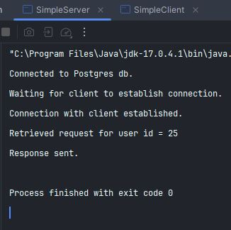
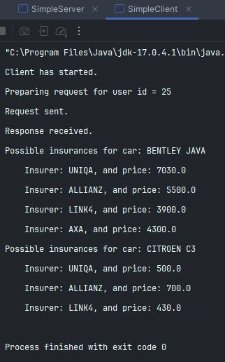

# Simple Server and Client with Socket Connection

This repository contains a simple server and client communication implemented through a socket connection.

Below screenshots of server and client outputs:

## Instructions to run:
1. execute command `docker compose up -d` in terminal to set up postgres
2. execute SQL queries provided in [queries.sql](sql-queries-to-initialize-db.sql) for example using pgAdmin (accessible on localhost:8888)
2. run `SimpleServer` class to start the server
3. run `SimpleClient` class to start the client

Make sure you have docker installed and running before executing the `docker compose up -d` command
